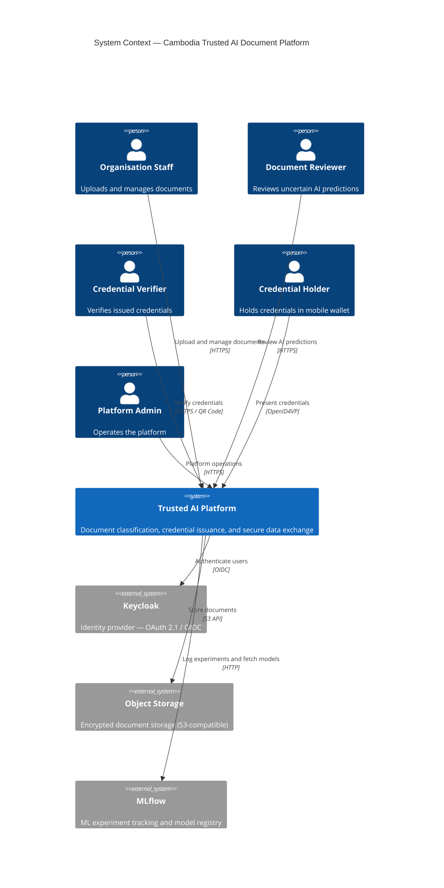
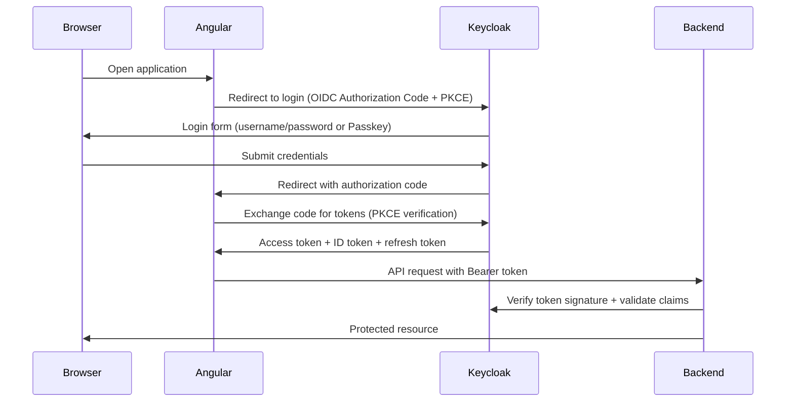
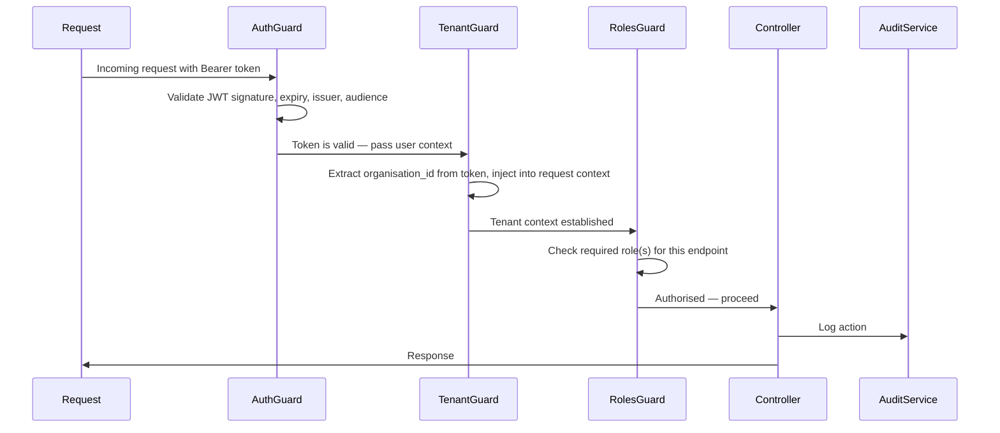
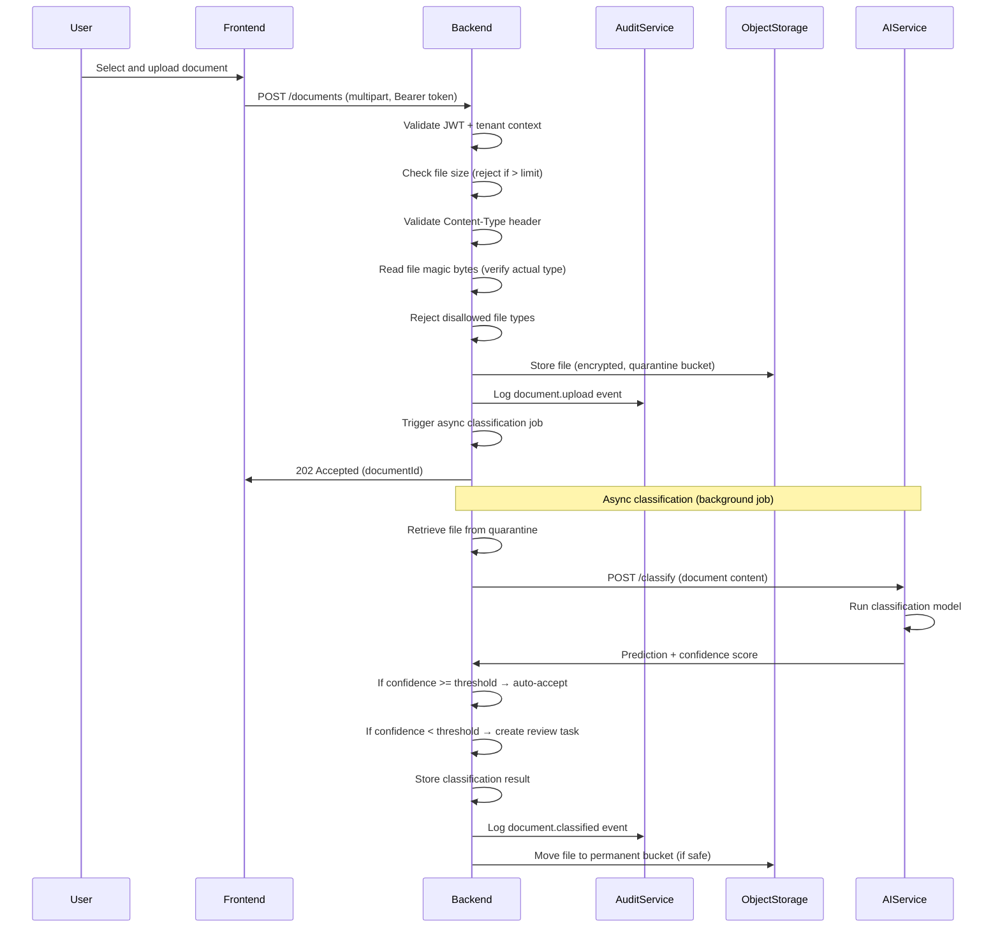
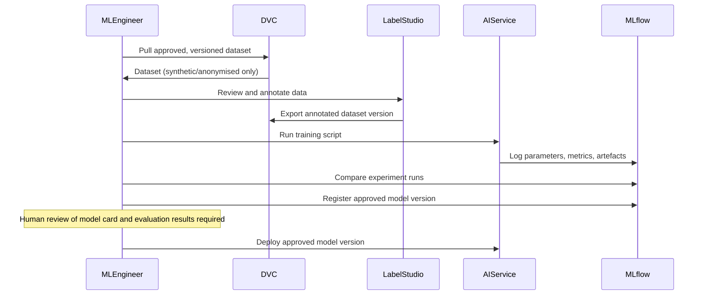
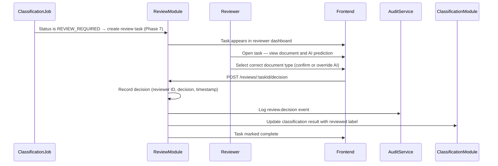
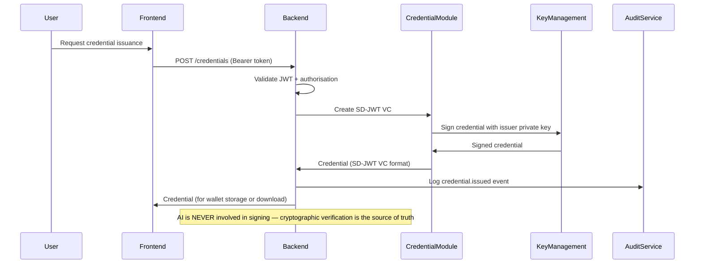
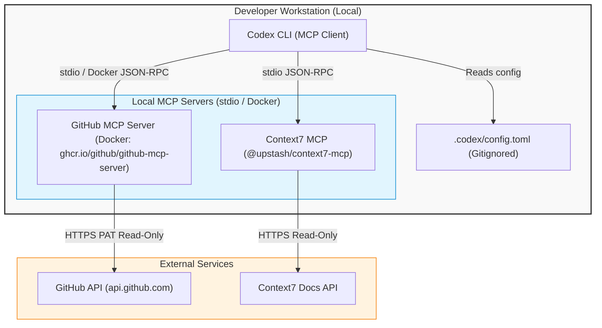

# ARCHITECTURE.md — Cambodia Trusted AI Document Platform

> **Status:** Living document — updated as architecture evolves.
> **Last updated:** 2026-08-01
> **Phase:** Phase 0 — Documentation and Governance Foundation: Complete

---

## 1. System Context

The platform operates as a multi-tenant SaaS system. Each **organisation** (tenant) has fully isolated data. The system interacts with:

- **Organisation staff** — upload and manage documents via a web browser.
- **Document reviewers** — validate uncertain AI predictions.
- **Credential verifiers** — verify signed credentials via QR code or API.
- **Credential holders** — hold and present credentials using a mobile wallet.
- **Platform administrators** — operate the platform and respond to incidents.



---

## 2. Application Boundaries

The following application boundaries describe the approved target architecture. The application directories will be created during Phase 1 and are not present in the Phase 0 repository.

The platform is structured as a **monorepo** containing three applications and one shared package:

| Application | Technology | Responsibility |
|---|---|---|
| `apps/backend` | NestJS (TypeScript) | Main API server. Handles authentication, business logic, document management, credential issuance, audit logging. |
| `apps/ai-service` | FastAPI (Python) | AI inference and training. Document classification, information extraction, explanation generation. Communicates with backend via HTTP only. |
| `apps/frontend` | Angular (TypeScript) | Web application. Document upload, prediction display, human-review workflow, credential management. |
| `packages/shared-types` | TypeScript | Shared TypeScript types, OpenAPI schemas, and constants. Used by backend and frontend. |

### Why a separate AI service?

See [ADR-0005](docs/adr/ADR-0005-ai-service-separation.md). Python and Node.js have incompatible runtime and dependency models. PyTorch and Hugging Face require Python. A clean HTTP boundary enables independent scaling and deployment without coupling the runtimes.

### Why a modular monolith in the backend?

See [ADR-0001](docs/adr/ADR-0001-monorepo-strategy.md). A modular monolith keeps complexity manageable for the current team size while allowing clear module boundaries that can be extracted into separate services if scaling demands it.

---

## 3. Module Responsibilities (NestJS Backend)

| Module | Owns | Responsibilities |
|---|---|---|
| `AuthModule` | JWT validation, session | Token verification, user context extraction, Keycloak integration. |
| `OrganisationModule` | `organisations` table | Tenant management, organisation CRUD, tenant-context middleware. |
| `UserModule` | `users` table | User profile management, role assignments within a tenant. |
| `DocumentModule` | `documents`, `document_files` tables | Document upload, metadata storage, file-lifecycle management. |
| `ClassificationModule` | `classification_results` table | Communicates with AI service, stores predictions, evaluates confidence, sets `REVIEW_REQUIRED` status. (Phase 6) |
| `ReviewModule` | `review_tasks`, `review_decisions` tables | Human-review workflow management: queue, reviewer UI, decision submission, override metrics. (Phase 7) |
| `CredentialModule` | `credentials`, `credential_revocations` tables | Credential issuance (SD-JWT VC), signing, revocation. (Phase 11) |
| `AuditModule` | `audit_events` table | Append-only audit event recording. Shared service used by all other modules. |
| `HealthModule` | — | `/health` endpoint for Docker and Kubernetes health checks. |

### Module isolation rules

- Modules communicate via NestJS dependency injection (service imports), not direct database access into another module's tables.
- The `AuditModule` is a shared service available to all modules.
- The `AuthModule` and `OrganisationModule` are loaded by all other modules for context extraction.

---

## 4. Data Ownership

| Data entity | Owner module | Table | Tenant-scoped? |
|---|---|---|---|
| Organisations | OrganisationModule | `organisations` | No (root entity) |
| Users | UserModule | `users` | Yes |
| Documents | DocumentModule | `documents` | Yes |
| Document files | DocumentModule | `document_files` | Yes |
| Classification results | ClassificationModule | `classification_results` | Yes |
| Review tasks | ReviewModule | `review_tasks` | Yes |
| Review decisions | ReviewModule | `review_decisions` | Yes |
| Credentials | CredentialModule | `credentials` | Yes |
| Credential revocations | CredentialModule | `credential_revocations` | Yes |
| Audit events | AuditModule | `audit_events` | Yes |

---

## 5. Trust Boundaries

```mermaid
graph TB
    subgraph "Public Internet"
        Browser["Browser (Angular)"]
        MobileWallet["Mobile Wallet (Flutter)"]
        Verifier["Credential Verifier"]
    end

    subgraph "DMZ / Reverse Proxy"
        ReverseProxy["Nginx / Reverse Proxy\n(TLS termination)"]
    end

    subgraph "Internal Network — Application Layer"
        Backend["NestJS Backend\n(apps/backend)"]
        AIService["FastAPI AI Service\n(apps/ai-service)"]
        Keycloak["Keycloak\n(Identity Provider)"]
    end

    subgraph "Internal Network — Data Layer"
        PostgreSQL["PostgreSQL 17\n(Row-Level Security)"]
        ObjectStorage["Object Storage\n(Encrypted at rest)"]
        MLflow["MLflow\n(Model Registry)"]
    end

    Browser -->|HTTPS| ReverseProxy
    MobileWallet -->|HTTPS| ReverseProxy
    Verifier -->|HTTPS| ReverseProxy
    ReverseProxy -->|HTTP (internal)| Backend
    Backend -->|HTTP (internal)| AIService
    Backend -->|OIDC| Keycloak
    Backend -->|SQL (TLS)| PostgreSQL
    Backend -->|S3 API (TLS)| ObjectStorage
    AIService -->|HTTP (internal)| MLflow
    AIService -.->|NO DIRECT ACCESS| PostgreSQL
    AIService -.->|NO DIRECT ACCESS| ObjectStorage
```

### Keycloak Network Exposure Architecture

- **Local Development:** Keycloak is accessible to the user's browser via `http://localhost:<keycloak-port>` to enable the OpenID Connect (OIDC) Authorization Code with PKCE login redirect flow. Other infrastructure services (PostgreSQL, MinIO admin, AI service) remain bound to the internal Docker network.
- **Staging & Production:** The user browser communicates exclusively via the HTTPS Reverse Proxy (`https://<domain>/auth` routing to internal Keycloak). Keycloak is never exposed directly to the public internet without TLS reverse-proxy termination. Administrative endpoints (`/admin`) are restricted. Internal service-to-service communication stays within the private network.


**Trust rules:**
- The reverse proxy terminates TLS. All internal traffic is on a private Docker network.
- The AI service is not exposed externally. It is reachable only by the backend.
- The AI service has no database credentials. All data access goes through the backend API.
- JWT tokens issued by Keycloak are validated by the backend on every protected request.
- PostgreSQL row-level security enforces tenant isolation as a second layer.

---

## 6. Authentication Flow



**Implementation notes:**
- The Angular frontend uses the Keycloak JavaScript adapter or a compatible OIDC library.
- PKCE is mandatory (OAuth 2.1 requirement).
- The backend validates the JWT signature using Keycloak's JWKS endpoint.
- The backend extracts `sub` (user ID), `organisation_id` (custom claim), and `roles` from the token.
- Refresh tokens are handled client-side. The backend does not store sessions.

---

## 7. Authorisation Flow



**Implementation notes:**
- Guards are applied in order: `AuthGuard` → `TenantGuard` → `RolesGuard`.
- The `organisation_id` from the token is injected into every database query as a mandatory filter.
- PostgreSQL row-level security provides a second enforcement layer.
- A failed authorisation check at any guard immediately returns 401 or 403 and logs the event.

---

## 8. Tenant Isolation

Tenant isolation is enforced at three layers:

| Layer | Mechanism | Strength |
|---|---|---|
| Application layer | `organisation_id` mandatory filter in every repository method | High — enforced in code |
| Database layer | PostgreSQL row-level security policies | High — enforced in DBMS |
| Network layer | Internal services not exposed externally | Medium — network segmentation |

**Rules:**
- Every database table that contains tenant data has an `organisation_id` column.
- Every query against tenant data includes `WHERE organisation_id = :tenantId`.
- The `organisation_id` is always taken from the JWT token, never from request query parameters or body.
- RLS policies are applied per-table during database initialisation.
- Tenant isolation must be covered by dedicated integration tests.

---

## 9. Secure Document Processing Flow



**Security notes:**
- Uploaded files are stored in a quarantine bucket before classification.
- Files are moved to the permanent bucket only after passing all validation and classification steps.
- The malware scanning integration point (ClamAV) is inserted between storage and classification.
- The AI service never receives the raw file path — only the document content (text or image bytes over HTTP).

---

## 10. AI Training Flow



---

## 11. Human Review Flow



---

## 12. Credential Issuance Flow (Phase 11+)



---

## 13. Audit Logging

All important actions are recorded in the `audit_events` table.

**Mandatory audit events:**

| Category | Events |
|---|---|
| Authentication | `auth.login`, `auth.logout`, `auth.login.failed`, `auth.token.refresh` |
| Document | `document.upload`, `document.classified`, `document.reviewed`, `document.deleted` |
| Review | `review.task.created`, `review.decision.submitted` |
| Credential | `credential.issued`, `credential.revoked`, `credential.verified` |
| Administration | `user.created`, `user.role.changed`, `user.deleted`, `organisation.created` |
| AI | `ai.prediction`, `ai.model.deployed`, `ai.model.rollback` |
| Security | `auth.login.failed`, `permission.denied`, `file.rejected`, `tenant.isolation.violation` |

**Audit event structure:**

```typescript
interface AuditEvent {
  id: string;             // UUID
  eventType: string;      // e.g., 'document.upload'
  actorId: string;        // User ID (from JWT)
  actorType: string;      // 'user' | 'service' | 'system'
  organisationId: string; // Tenant ID
  resourceType: string;   // e.g., 'document'
  resourceId: string;     // ID of the affected resource
  outcome: 'success' | 'failure';
  metadata: Record<string, unknown>; // Additional context (no personal data)
  ipAddress: string;      // Anonymised (last octet zeroed for privacy)
  timestamp: Date;        // UTC, server-generated
}
```

**Integrity rules:**
- The application role has INSERT only on `audit_events` — no UPDATE or DELETE.
- A separate privileged role is required to query audit logs for compliance purposes.
- Tamper-evident enhancement (hash chaining or write-once storage) is a Phase 16 requirement.

---

## 14. Observability

Introduced incrementally. See `ROADMAP.md` for phase targets.

| Phase | Capability |
|---|---|
| Phase 1 | Structured JSON logging foundations (Pino/Winston in NestJS, Python logging in FastAPI) |
| Phase 5 | OpenTelemetry SDK integration and Prometheus metrics endpoint. |
| Phase 5 | Grafana + Loki + Tempo stack in Docker Compose. |
| Phase 16 | Production observability in Kubernetes. |

**Logging standards:**
- All log entries are JSON.
- All entries include: `timestamp`, `level`, `service`, `traceId`, `message`.
- No personal data, document content, or secrets in log entries.
- Log levels: `error`, `warn`, `info`, `debug`. Debug is disabled in production.

---

## 15. External Integrations

| Integration | Purpose | Phase | Notes |
|---|---|---|---|
| Keycloak | Keycloak infrastructure and local-development configuration | Phase 1 | Self-hosted Docker container, realm bootstrap configuration placeholder |
| Authentication and authorisation | User login flow, JWT validation, roles, tenant-context middleware | Phase 3 | Keycloak JWKS, AuthModule, OrganisationModule |
| Object storage (S3-compatible API locally and in production) | Document storage | Phase 4 | Encrypted at rest; local container strategy subject to ADR-0008 |
| ClamAV | Malware scanning of uploaded files | Phase 4 | Implemented as part of the secure upload and quarantine workflow |
| MLflow | ML experiment tracking and model registry | Phase 6 | Self-hosted |
| Label Studio | Data annotation | Phase 10 | Self-hosted |
| DVC + remote storage | Dataset versioning | Phase 6 | Remote: S3-compatible |
| Prometheus + Grafana + Loki + Tempo | Observability | Phase 5 | Self-hosted |
| vLLM | Production model serving (if required) | Phase 8+ | Only if latency justifies it |
| Eclipse Dataspace Components | Inter-organisation data sharing | Phase 14 | Not yet adopted |

---

## 16. Failure Handling

| Scenario | Behaviour |
|---|---|
| AI service unavailable | Backend returns 503 to the client. Document is stored with status `classification_pending`. Background job retries with exponential backoff. |
| Classification confidence below threshold | Create a human-review task. Document status is `awaiting_review`. Do not auto-accept. |
| Database write failure | Transaction rolled back. Error logged. Structured error response returned. Audit event recorded if possible. |
| File upload exceeds size limit | Request rejected with 413 before file is read into memory. |
| Invalid file type detected | Request rejected with 422. Audit event `file.rejected` logged. |
| JWT expired or invalid | Request rejected with 401. No further processing. |
| Tenant isolation violation detected | Request rejected with 403. Security alert logged as `tenant.isolation.violation`. |

---

## 17. Deployment Evolution

| Phase | Deployment model |
|---|---|
| Phase 0 | Pure documentation foundation. |
| Phase 1 | Monorepo scaffold and local Docker Compose infrastructure. |
| Phase 2–15 | Docker Compose development environment across feature phases. |
| Phase 16 | Kubernetes (production). Helm charts. Argo CD GitOps. OpenTofu for infrastructure. |

---

## 18. Model Context Protocol (MCP) Integration Boundary

MCP serves as an **AI-assisted development integration layer**, NOT as the primary application architecture or service-to-service communication framework.



### Key Architectural Boundaries for MCP
1. **Separation from Production Runtime:** MCP servers are developer tools in Stages 1–3 and never connect to production databases or services.
2. **Protocol Boundary:** MCP operates via JSON-RPC over stdio or Docker process pipes.
3. **Identity & Authorization:** Local MCP tools run under the developer's personal access credentials (e.g. read-only GitHub PAT), never system service accounts.
4. **Data Isolation:** Application business logic, NestJS modules, and database repositories do not invoke MCP servers. MCP wraps external context for the AI agent, not application code.

---

*See `docs/adr/` for all Architecture Decision Records that underpin this design.*

